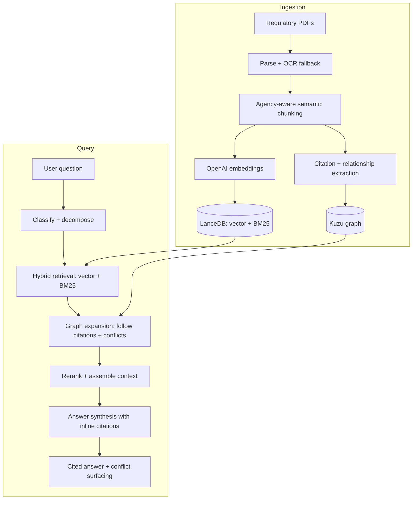

# PolicyBridge

A retrieval-augmented chat agent that answers complex, cross-agency regulatory questions about Seattle-area development and returns precise, cited answers grounded in the actual text of the law. It also surfaces policy friction: contradictions, overlapping jurisdiction, and gaps between agencies.

Users such as developers, planners, attorneys, and policy analysts can ask a question that spans multiple codes (for example, "How tall can a wood-frame apartment building be in a Midrise zone?") and get an answer that cites the exact sections, and flags where two agencies set different rules.

## What it covers

The system reasons across 8 Seattle-area regulatory sources:

- **SMC** - Seattle Municipal Code
- **WAC** - Washington Administrative Code
- **RCW** - Revised Code of Washington
- **Seattle Director's Rules**
- **IBC-WA** - International Building Code, Washington amendments
- **WA Court Opinions**
- **Governor's Orders**
- **SPU Design Standards**

## How it works



The retrieval path combines hybrid search (dense vectors plus BM25 in LanceDB) with a knowledge graph (Kuzu) that links sections to the sections they cite and the rules they overlap with. That graph step is what lets the system follow a cross-reference from one agency into another and notice when two rules collide.

## Tech stack

| Layer | Choice |
|---|---|
| Backend | FastAPI (async) |
| Vector + keyword store | LanceDB (hybrid vector + BM25, embedded) |
| Knowledge graph | Kuzu (embedded, Cypher-compatible) |
| Embeddings | OpenAI `text-embedding-3-large` |
| Query decomposition | GPT-4.1 mini |
| Answer synthesis | GPT-5.1 |
| PDF parsing | Docling (primary), PyMuPDF4LLM (fallback) |
| Chunking | semchunk with agency-aware section boundaries |

## Project structure

```
src/
  chunkers/     Per-agency semantic chunkers (SMC, WAC, RCW, IBC-WA, ...)
  embeddings/   OpenAI embedding wrapper
  ingestion/    PDF parsing + the ingestion pipeline
  storage/      LanceDB + conversation/trace persistence
  graph/        Kuzu graph build, citation index, traversal, conflict logic
  retrieval/    Hybrid search, graph expansion, fusion, reranking
  query/        Classify, decompose, synthesize answer pipeline
  server/       FastAPI app, auth, and the chat + audit UI
lib/            Frontend vendor libraries for the graph view
scripts/        start.py (launch), run_full.py + run_graph.py (build stores)
```

## Getting started

This repository contains the application code. It does not include the regulatory source documents or the prebuilt LanceDB and Kuzu stores, which are generated locally from your own copy of the documents.

```bash
# 1. Create a virtual environment and install dependencies
python -m venv .venv
source .venv/bin/activate
pip install -r requirements.txt

# 2. Configure secrets
cp .env.example .env
# then edit .env and set OPENAI_API_KEY (and the access secrets)

# 3. Build the vector store and graph from your documents
python scripts/run_full.py      # parse, chunk, embed -> LanceDB
python scripts/run_graph.py     # extract citations + relationships -> Kuzu

# 4. Run the server and open the chat UI
./start.sh
```

The server starts on `http://localhost:8000`.

## License

MIT. See [LICENSE](LICENSE).
